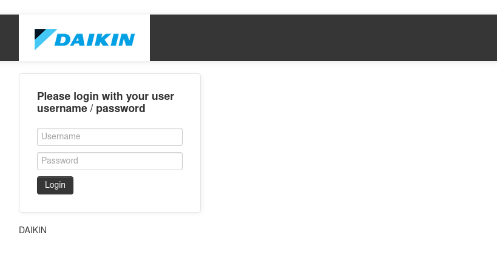
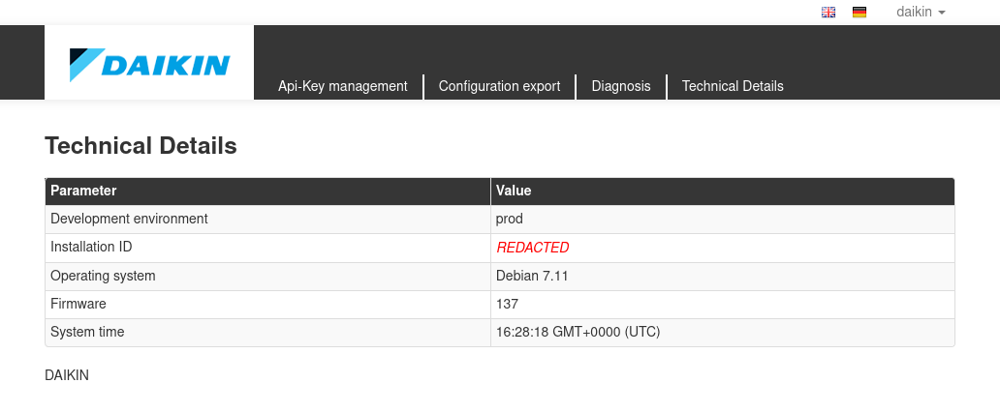
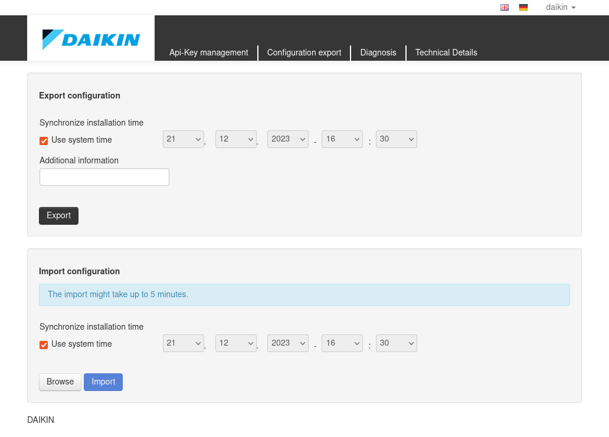
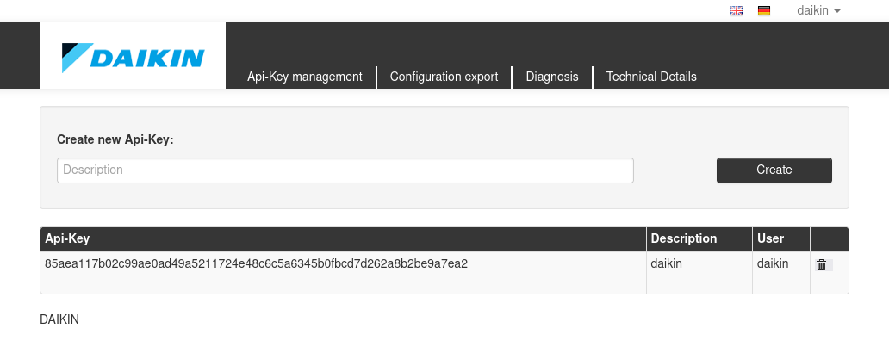
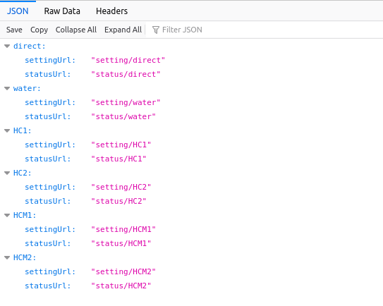
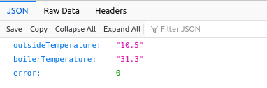
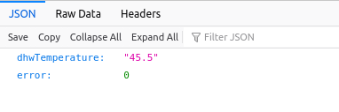
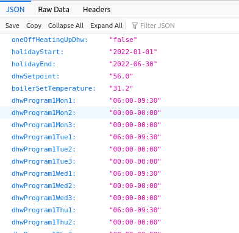
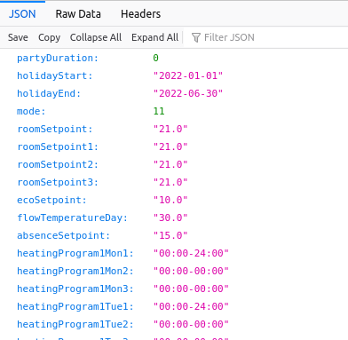

# ROTEX RoCon G1 Gateway

> ⚠️ This device contains very outdated software, contains known vulnerabilities
> and is in general a dangerous device to operate in your home network.

Besides the cloud service offered by Daikin it also offers a local web
service which is hidden behind a login with no user accounts configured.
The following steps describe how to gain access to the device and fixing
the most obvious security issue at hand.

## How to gain root access?

The device uses the default password for the `debian` user and the user
`debian` has `sudo` rights.

| Login  | Password |
| ------ | -------- |
| debian | temppwd  |

```
root@brain:~# ssh debian@rocon-g1.local
debian@192.168.178.135's password: (enter `temppwd` here)
Last login: Thu Dec 21 16:05:10 2023 from brain.fritz.box
debian@rocon-g1:~$ sudo -i
root@rocon-g1:~#
```

How old is the system software exactly?

```
root@rocon-g1:~# lsb_release -a
No LSB modules are available.
Distributor ID:	Debian
Description:	Debian GNU/Linux 7.11 (wheezy)
Release:	7.11
Codename:	wheezy
```

[Debian "wheezy"](https://www.debian.org/releases/wheezy/) had LTS
support which ended May 2018. I bought this device September 2022
for a whopping 340 EUR.

## How do I fix this?

Set a proper password for the `debian` user:

```
# passwd debian
New password: (no output shown)
Retype new password:  (no output shown)
passwd: password updated successfully
#
```

## What's up with the application code?

All the source code of the device is located under `/var/local`:

```
root@rocon-g1:~# ls -l /var/local
total 8
drwxr-sr-x  4 root root  4096 Apr 23  2021 node_modules
drwxr-sr-x 12 root staff 4096 Jun 15  2023 rocon-g1
```

In there you find a NodeJS project running with
[NodeJS 0.10.42](https://nodejs.org/en/blog/release/v0.10.42)
which was released 2016-02-09. There are several CVEs
listed in the [CHANGELOG for Version 0.10](https://github.com/nodejs/node/blob/main/doc/changelogs/CHANGELOG_V010.md#0.10.42). The last 0.10 version of NodeJS was released on
2016-10-18 (0.10.48) so it is only natural to assume
that it contains more vulnerabilities which were fixed in
more recent NodeJS versions.

I haven't checked for any known remote exploits as accessing
the device via SSH and the default user password already provides
full root access.

If you really want a secure home network don't allow this device
to connect to the internet or your home network. Either disconnecting
the power supply or unplugging the network cable does the trick.

You could also replace the operating system and use it as an
overpriced Beagle Bone Black in a nice case with built-in CAN bus
interface.

## How to access the local web interface?

I you're curious what this device was supposed to be before ROTEX and/or
Daikin decided to make this a cloud-only device continue reading.



After a thorough inspection of the source code I found the software
accessing a file called `/home/root/.rocon/user.json` which contains a
JSON array of credential objects. The password and some salt is hashed
with SHA512 and the digest base64 encoded.

```json
[
  {
    "username": "daikin",
    "password": "Ty4iIuCHfARd57tvN5EA1QZPgDNeHFHNcpNNCipeWyls2FvPK9h/xNMZrO0ddNi3UO9qJbVki1oyWG3UnMdyJQ==",
    "salt": "salt"
  }
]
```

The easiest way to create this password hash is to utilize some `python` code:

```python
>>> import hashlib, base64
>>> base64.b64encode(hashlib.sha512(b"daikinsalt").digest())
b'Ty4iIuCHfARd57tvN5EA1QZPgDNeHFHNcpNNCipeWyls2FvPK9h/xNMZrO0ddNi3UO9qJbVki1oyWG3UnMdyJQ=='
```

After creating that file you should be able to access the webserver
running at <http://rocon-g1.local>:



You can even import and export your configuration:



The Api-Key management page allows you to create API keys:



Once the API key was generated you can access the URLs at `/api/` and passing
the `apiKey` parameter. e.g. <http://rocon-g1.local/api/?apiKey=85aea117b02c99ae0ad49a5211724e48c6c5a6345b0fbcd7d262a8b2be9a7ea2>

## API

<http://rocon-g1.local/api?apiKey=85aea117b02c99ae0ad49a5211724e48c6c5a6345b0fbcd7d262a8b2be9a7ea2>



<http://rocon-g1.local/api/status/direct?apiKey=85aea117b02c99ae0ad49a5211724e48c6c5a6345b0fbcd7d262a8b2be9a7ea2>



<http://192.168.178.135/api/status/water?apiKey=85aea117b02c99ae0ad49a5211724e48c6c5a6345b0fbcd7d262a8b2be9a7ea2>



<http://rocon-g1.local/api/setting/water?apiKey=85aea117b02c99ae0ad49a5211724e48c6c5a6345b0fbcd7d262a8b2be9a7ea2>



<http://rocon-g1.local/api/status/HC1?apiKey=85aea117b02c99ae0ad49a5211724e48c6c5a6345b0fbcd7d262a8b2be9a7ea2>



## Download the Rocon G1 software from the update server

Updates are requested from this URL:

    https://api.rotex-control.com/installation/update/`<hwaddr>`/`<version>`

`<hwaddr>` must be replaced by the hardware address of the eth0 device all
uppercase with the `:` removed. This identical to the `Asset number` that
is printed on the Rocon G1 device. The software actually calls
`ifconfig eth0` internally to get to detect its own identity.

`<version>` is the version number you want to upgrade from. You can just
use `0` to get the most recent version no matter what. When using a `137`
the server responts with `HTTP/1.1 204 No Content` as there is no update
available.

There are plenty of photos in the web with hardware addresses shown that
work just fine: https://duckduckgo.com/?q=daikin+rocon+g1&iax=images&ia=images

## Final thoughts

This device could've been great. The general software engineering is well
done. The code is written in a testable way using dependency injection.
I've rarely seen such software engineering in other JavaScript projects.
Kudos the the developers for the overall architecture.

The software is very incomplete and unfinished however. I've spent numerous
hours trying to make sense of the data coming from my heat pump until I
figured out that even some of the parameter definitions are plain wrong.

The local web site and API could've been awesome. Finishing it up and making
it available on the local network should be at most a few days of work. The
only official way to communicate with the device is via some very buggy and
slow cloud service offered at <https://www.daikin-control.com/login>.

Please don't get me wrong. I can see how such service could provide useful
for a service technician. If even basic features such as filtering by parameter
or heating circuit would work. When exporting parameters only the first 20
parameters are exported. Someone seams to have forgotten to disable pagination.
The visualization of parameters is a nice feature though.

But then... does that really have to be a cloud service? All that served by
an overpriced box ridden by known security vulnerabilities?

My heating system is going to stay with me for the next 10 to 20 years, I
hope. This is reason enough to act before things turn sour.
